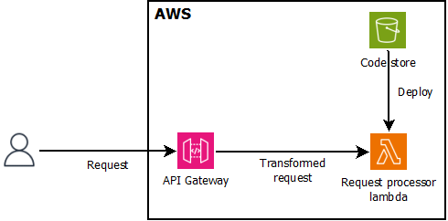

# API Gateway - IAM Authentication

## Prerequisites
- [PowerShell](https://learn.microsoft.com/en-us/powershell/scripting/install/installing-powershell-on-windows?view=powershell-7.4#install-powershell-using-winget-recommended)
- Node.js, version min. 18.x
- npm
- configured [AWS CLI](https://docs.aws.amazon.com/cli/latest/userguide/getting-started-install.html#getting-started-install-instructions)
- [Postman](https://www.postman.com/ )

## Installation
- [create](https://docs.aws.amazon.com/IAM/latest/UserGuide/id_users_create.html ) an IAM user and save its `Access` and `Secret key`
- copy the user ARN to `service1.json.externalClientArns`
- `.\Deploy-Foundation.ps1 -action create -config "./foundation.json" -region eu-central-1 -profile default`
- `.\Deploy-Service.ps1 -action create -region eu-central-1 -service service1 -config "./service1.json" -profile default`

## Test
In Postman create a new POST request using the URL returned by the `Deploy-Service.ps1` script.
On the `Authorization` tab set
- `Auth Type` to `AWS Signature`
- `AccessKey` to your test user's access key
- `SecretKey` to your test user's secret key
- `AWS Region` to the region where you deployed your stack
- `Service Name` to `execute-api`

On the `Body` tab set up a `raw` request using one of the following JSONs:
- `{"someParameter": "echo"}` to echo the request and the client details
- `{"someParameter": "error"}` to return HTTP 500
- `{"someParameter": "invalid"}` to return HTTP 400