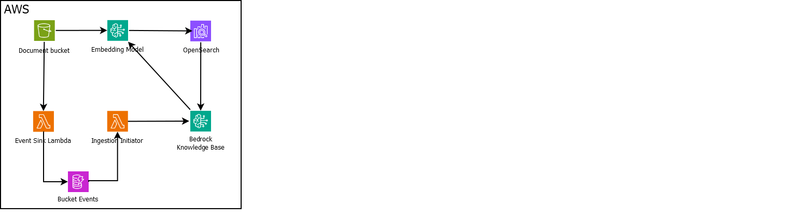

# Bedrock Knowledge Base

## Prerequisites
- [PowerShell](https://learn.microsoft.com/en-us/powershell/scripting/install/installing-powershell-on-windows?view=powershell-7.4#install-powershell-using-winget-recommended)
- Configured [AWS CLI](https://docs.aws.amazon.com/cli/latest/userguide/getting-started-install.html#getting-started-install-instructions)
- [Access](https://us-east-1.console.aws.amazon.com/bedrock/home?region=us-east-1#/modelaccess) to `Titan Embeddings G1 - Text` and one of the foundation models (for instance `Claude 3 Sonnet`)

## Installation
- `.\Deploy-KB.ps1 -action create -app bedrock-kb -profile default`

## Test
- Copy `letter.txt` to the data bucket
- Wait for the ingestion to be run or trigger it manually
- Go to the [knowledge bases](https://us-east-1.console.aws.amazon.com/bedrock/home?region=us-east-1#/knowledge-bases) and click "Test knowledge base"
 