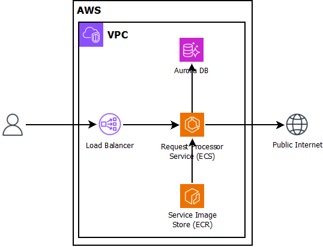

# Fargate Service

## Prerequisites
- [PowerShell](https://learn.microsoft.com/en-us/powershell/scripting/install/installing-powershell-on-windows?view=powershell-7.4#install-powershell-using-winget-recommended)
- configured [AWS CLI](https://docs.aws.amazon.com/cli/latest/userguide/getting-started-install.html#getting-started-install-instructions)
- [Docker desktop](https://www.docker.com/products/docker-desktop/ )

## Installation
- `.\Create-Cert.ps1 -commonName www.example.com -region eu-central-1 -profile default`
- save the returned certificate ARN
- `.\Deploy-Foundation.ps1 -action create -app fargate-service -certificateArn arn:aws:acm:... -region eu-central-1 -profile default`
- save the returned endpoint URL
- `.\Deploy-Service.ps1 -action create -app fargate-service -service service1 -profile default -region eu-central-1`

## Test
Open your browser and go to the endpoint that was returned by `Deploy-Foundation.ps1`. To trigger a health-check visit `/healthcheck`
