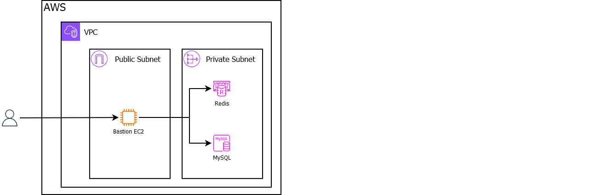

# Resource access via SSH

## Prerequisites
- [PowerShell](https://learn.microsoft.com/en-us/powershell/scripting/install/installing-powershell-on-windows?view=powershell-7.4#install-powershell-using-winget-recommended)
- configured [AWS CLI](https://docs.aws.amazon.com/cli/latest/userguide/getting-started-install.html#getting-started-install-instructions)

## Installation
- `.\Deploy-Foundation.ps1 -action create -app bastion -region eu-central-1 -profile default`

## Test
The install script will
- print
  - the **public** (accessible from the internet) endpoint belongs to the bastion EC2 (you can use it as an SSH host)
  - the **private** (accessible within the VPC only) endpoints belong to the resources (MySql & Redis) 
- dump
  - the private key (`bastion-private.pem`) required for the SSH tunneling (SSH username is **ec2-user**)
  - credential file (`mysql.secret`) containing the MySQL credentials
  
Use the provided data to configure for instance the [MySQL Workbench](https://dev.mysql.com/downloads/workbench/)