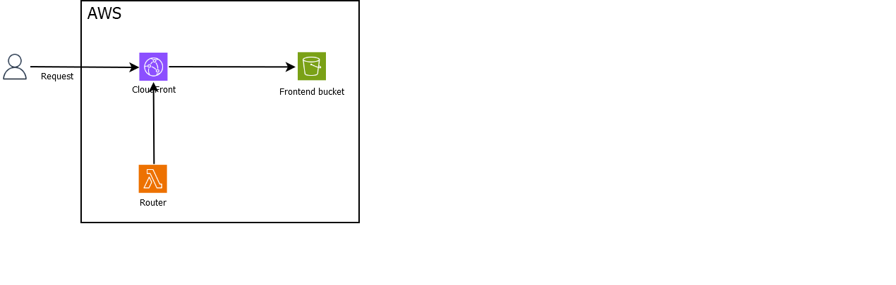

# S3 backed homepage

## Prerequisites
- [PowerShell](https://learn.microsoft.com/en-us/powershell/scripting/install/installing-powershell-on-windows?view=powershell-7.4#install-powershell-using-winget-recommended)
- configured [AWS CLI](https://docs.aws.amazon.com/cli/latest/userguide/getting-started-install.html#getting-started-install-instructions)

## Installation
- `.\Deploy-Global.ps1 -action create -app s3-backed-homepage -profile default`
- `.\Deploy-Foundation.ps1 -action create -app s3-backed-homepage -region eu-central-1 -profile default`
- `.\Deploy-Frontend.ps1 -app s3-backed-homepage -profile default`

## Test
Visit `https://DISTRO_ID.cloudfront.net` or `https://DISTRO_ID.cloudfront.net/index.html` or `https://DISTRO_ID.cloudfront.net/ANY_INVALID`
 